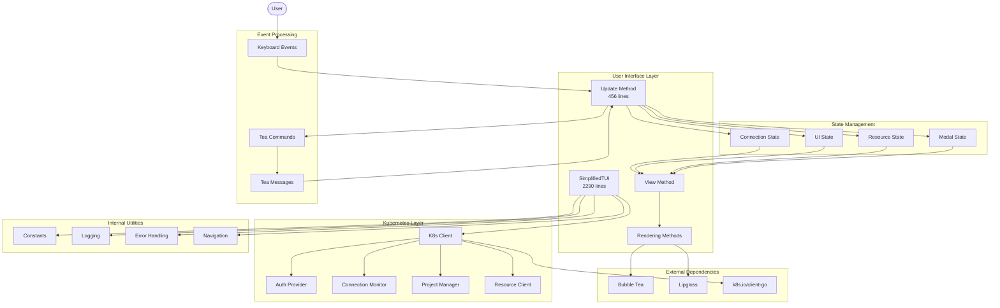
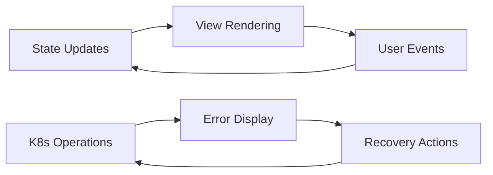
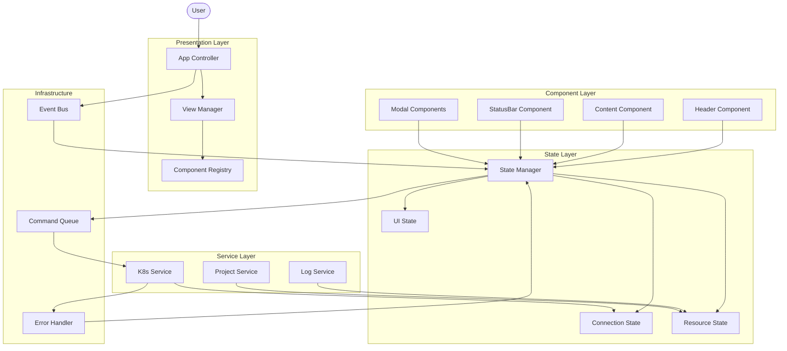

# TUI Dependencies and Component Map

## Current Dependencies Flow



## Component Coupling Analysis

### High Coupling Areas

1. **Update Method**
   - Directly modifies 15+ state fields
   - Handles 20+ different message types
   - Contains business logic mixed with UI logic

2. **Rendering Methods**
   - Direct access to all state fields
   - Complex layout calculations inline
   - Style definitions mixed with content

3. **K8s Operations**
   - Scattered throughout the file
   - No clear separation between UI and API calls
   - Error handling mixed with UI updates

### Circular Dependencies



## Proposed Decoupled Architecture



## Dependency Injection Plan

```go
// Core interfaces
type Component interface {
    Init(state StateReader) error
    Update(event Event) (Command, error)
    View() string
}

type StateReader interface {
    GetConnectionState() ConnectionState
    GetResourceState() ResourceState
    GetUIState() UIState
}

type Service interface {
    Execute(ctx context.Context, cmd Command) error
}

// Dependency injection
type App struct {
    state      *StateManager
    components map[string]Component
    services   map[string]Service
    eventBus   *EventBus
}
```

## Module Boundaries

### Clear Responsibilities

1. **Components**: Only UI rendering and local state
2. **State Manager**: Central state coordination
3. **Services**: Business logic and external integrations
4. **Event Bus**: Message routing and command dispatch

### Communication Rules

1. Components → State: Read only via interfaces
2. Components → Services: Via commands only
3. Services → State: Via events only
4. State → Components: Via subscriptions

## Testability Improvements

### Before (Current)
- Cannot test Update() without full setup
- Cannot isolate rendering logic
- K8s operations require live cluster

### After (Proposed)
- Mock state for component tests
- Mock services for integration tests
- Mock event bus for flow tests
- Isolated unit tests for each module